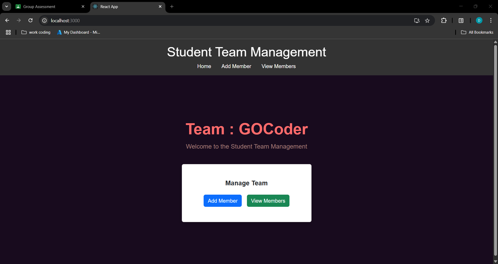
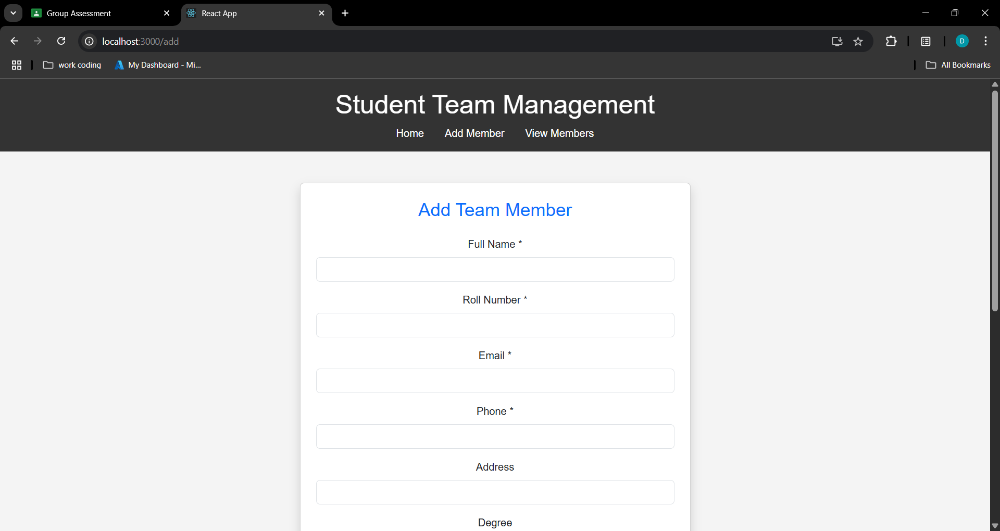
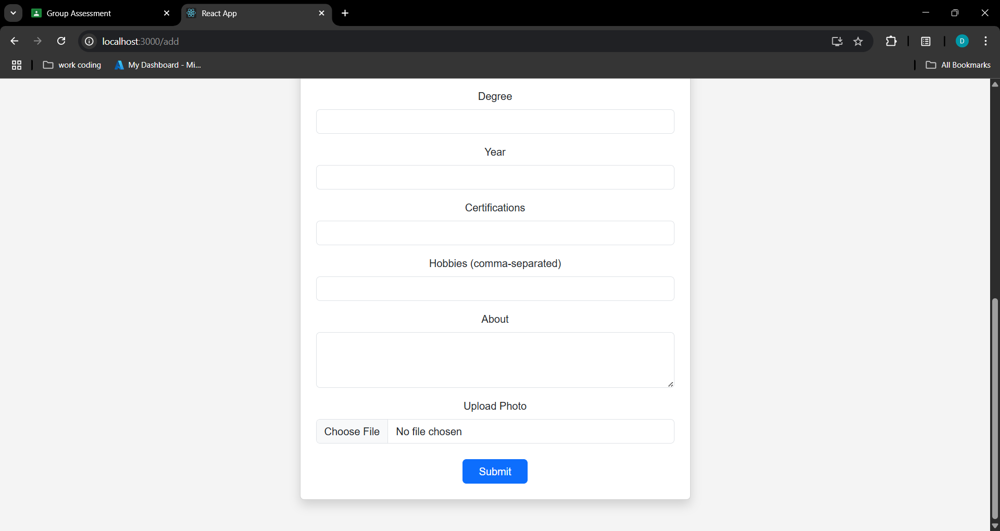
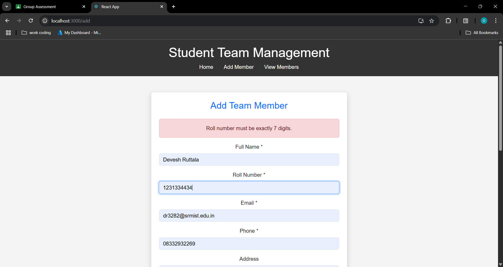

# FSD--CLAT-2-Online-Assessment-
Test: CLAT-2 (Online Assessment) Date: 30-04-2025 to 1-05-2025 (2 days) Course Code &amp; Title: 21CSS301T – FULL STACK DEVELOPMENT  - GRP Assignment 2025 - SEM 6 


# Student Team Members Management App

A full-stack web application built using **React.js**, **Node.js (Express)**, and **MongoDB** that allows users to **add**, **view**, and **delete** student team members with detailed profiles, including images.

---

## 📌 Project Features

- Add new student member with photo
- View list of all team members
- View individual member's profile details
- Delete a member
- Form validations for roll number, phone, and email
- Responsive UI styled with Bootstrap

---

## 🛠️ Tech Stack

- **Frontend:** React.js, React Bootstrap, Axios, React Router
- **Backend:** Node.js, Express.js
- **Database:** MongoDB with Mongoose
- **File Uploads:** Multer
- **Styling:** Bootstrap 5

---


## 📂 Project Structure

```plaintext
student-team-management-app/
├── client/                     # React frontend
│   ├── public/
│   └── src/
│       ├── components/         # Reusable components (Navbar, Cards)
│       ├── pages/              # Pages like Home, AddMember, ViewMembers, MemberDetails
│       ├── styles/             # Custom CSS files
│       ├── api.js              # Axios base API configuration
│       └── App.js              # Main App component with routing
│
├── server/                     # Express backend
│   ├── models/                 # Mongoose schemas (Member.js)
│   ├── routes/                 # Express routes (members.js)
│   ├── uploads/                # Uploaded member images
│   ├── .env                    # Environment variables
│   └── server.js               # Entry point of the backend
│   
├── README.md
│
└── .gitignore
```


## 🌐 API Endpoints

| Method | Endpoint             | Description           |
|--------|----------------------|-----------------------|
| GET    | `/api/members`       | Fetch all members     |
| GET    | `/api/members/:id`   | Fetch a single member |
| POST   | `/api/members`       | Add a new member      |
| DELETE | `/api/members/:id`   | Delete a member       |

---

## ▶️ How to Run the App

1. **Start MongoDB**  
   Make sure MongoDB is running locally, or update your MongoDB URI in `server.js` file, keep the port as 27017.

2. **Install Dependencies**  

**Clone the repository:**

    ```bash
    git clone https://github.com/yourusername/student-team-management-app.git
    cd student-team-management-app

    ```

    
   From the root directory, install dependencies for both backend and frontend:

   ```bash
   # Backend
   cd server
   npm install

   # Frontend
   cd ../client
   npm install
   ```

3. **Run the App**  
   In two separate terminals:

   ```bash
   # Start backend server
   cd server
   npm start
   ```

   ```bash
   # Start React frontend
   cd client
   npm start
   ```

4. **Access the App**  
   Open your browser and go to: [http://localhost:3000](http://localhost:3000)


## Outputs (screenshots)











### Team Members: GoCoders
- Devesh Ruttala (RA2211027010133)
- Srijan Saswat (RA2211027010094)
- Aditya Umashankar (RA2211027010103)
- Aditya K (RA2211027010076)